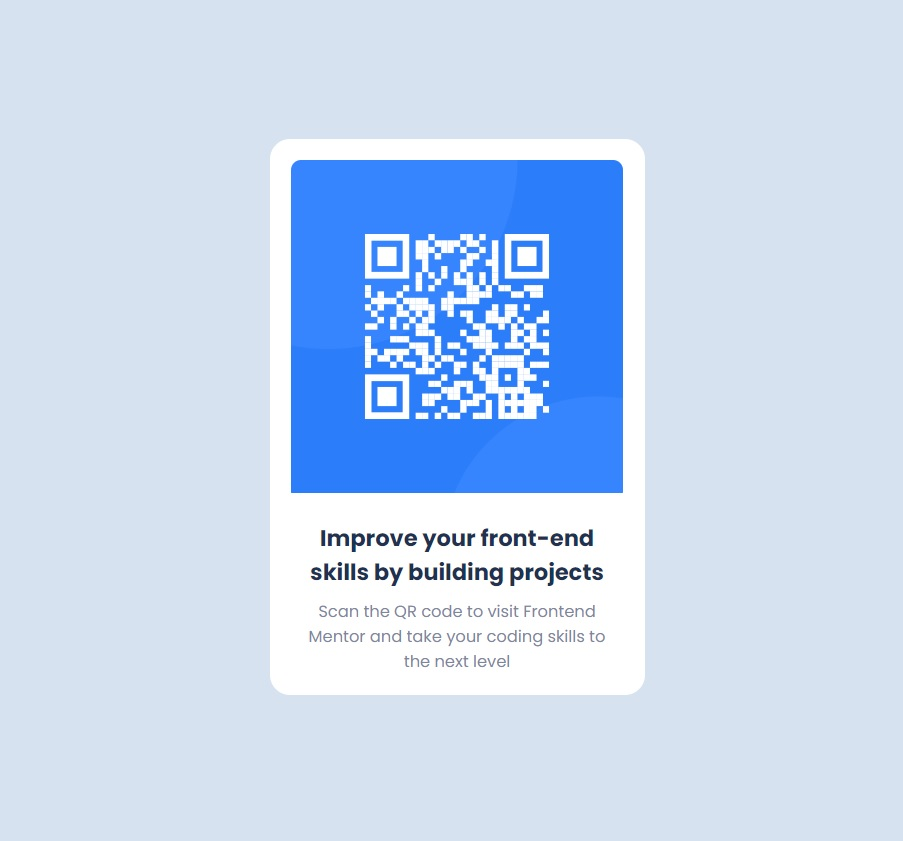

# Frontend Mentor - QR code component solution

This is a solution to the [QR code component challenge on Frontend Mentor](https://www.frontendmentor.io/challenges/qr-code-component-iux_sIO_H). Frontend Mentor challenges help you improve your coding skills by building realistic projects.

### Completed



### Built with

- HTML
- CSS custom properties
- Flexbox

### What I learned

Use this section to recap over some of your major learnings while working through this project. Writing these out and providing code samples of areas you want to highlight is a great way to reinforce your own knowledge.

To see how you can add code snippets, see below:

```html
<!DOCTYPE html>
<html lang="en">
  <head>
    <meta charset="UTF-8" />
    <meta name="viewport" content="width=device-width, initial-scale=1.0" />
    <link
      rel="icon"
      type="image/png"
      sizes="32x32"
      href="./images/favicon-32x32.png"
    />
    <link rel="stylesheet" href="styles.css" />
    <title>Frontend Mentor | QR code component</title>
  </head>
  <body>
    <div class="qr-card">
      <div class="qr-img">
        
      </div>
      <div class="qr-content">
        <h2>Improve your front-end skills by building projects</h2>
        <p>
          Scan the QR code to visit Frontend Mentor and take your coding skills
          to the next level
        </p>
      </div>
    </div>
  </body>
</html>
```

```css
@import url('https://fonts.googleapis.com/css2?family=Poppins:wght@300;400;700&display=swap');

:root {
  --color-white: hsl(0, 0%, 100%);
  --color-light-gray: hsl(212, 45%, 89%);
  --color-grayish-blue: hsl(220, 15%, 55%);
  --color-dark-blue: hsl(218, 44%, 22%);
}

* {
  margin: 0;
  padding: 0;
  box-sizing: border-box;
}

body {
  background-color: var(--color-light-gray);
  font-family: 'Poppins', sans-serif;
  font-size: 15px;
  height: 100vh;
  display: flex;
  align-items: center;
  justify-content: center;
  padding: 2em;
}

.qr-card {
  background-color: var(--color-white);
  width: 300px;
  padding: 1.125em;
  border-radius: 1rem;
  display: flex;
  flex-direction: column;
}

.qr-img {
  border-radius: 0.5rem;
  overflow: hidden;
  margin-bottom: 1rem;
}

.qr-img img {
  width: 100%;
}

.qr-content {
  text-align: center;
  padding-inline: 0.25em;
}
.qr-content h2 {
  font-size: 18px;
  color: var(--color-dark-blue);
  margin-bottom: 0.5rem;
  font-weight: 700;
}
.qr-content p {
  font-size: 13px;
  color: var(--color-grayish-blue);
  font-weight: 400;
}
```
